  

I build cloud platforms by day and a calmer phone by night. 
At <b>PayPal</b> I work on multi-tenant platforms and cloud migration. On my own time I build 
<b><a href="https://github.com/ThammanaSrinivas/zenmode">ZenMode OS</a></b>, an open-source Android launcher that helps people scroll less, together.

 

<picture>
  <source media="(prefers-color-scheme: dark)" srcset="assets/h-now-dark.svg" />
  
</picture>

<b>ZenMode OS</b> turns your home screen into a calm space built around intent. 
It doesn't lock you out. It adds a small pause at the moments you tend to lose time, 
and makes keeping your screen-time promise something you do <b>together with friends</b>.

<a href="https://github.com/ThammanaSrinivas/zenmode">
<picture>
  <source media="(prefers-color-scheme: dark)" srcset="assets/features-dark.svg" />
  
</picture>
</a>

  

<a href="https://www.producthunt.com/products/zenmode-os-android-launcher">
<picture>
  <source media="(prefers-color-scheme: dark)" srcset="assets/zm-stats-dark.svg" />
  
</picture>
</a>

 
Top ~10% of ~780 at <b>FOSS Hack 2026</b> · GPLv3 · Kotlin + Jetpack Compose · Issues and PRs welcome

 

<picture>
  <source media="(prefers-color-scheme: dark)" srcset="assets/h-work-dark.svg" />
  
</picture>

<picture>
  <source media="(prefers-color-scheme: dark)" srcset="assets/work-dark.svg" />
  
</picture>

<b>Career highlights</b>

 

**PayPal** · Software Engineer 2 · *May 2025 → now*
- **Multi-tenancy** across the Simplified Case Management (SCM) platform, plus SCM-Commons onboarding that cut new-tenant onboarding time by 40%
- **Notification API** raised 3 levels on the Richardson Maturity Model with zero breaking changes
- **LLM-powered engineering automation** replacing manual SOPs: an end-to-end code review agent, a parallel git-worktree feature processor, and an integration-test agent
- **On-prem → GCP** data migration, automated cloud migration, and cloud bug fixes
- **RAMP onboarding** of a SaaS-native solution to GCP, enabling cloud deployment for SCM workloads
- **Bigtable POC** benchmarking 500K+ records with secondary indexes; showed it didn't fit the relational model, avoiding a costly redesign

**Zoho** · Member of Technical Staff · *Jan 2022 → Apr 2025*
- **Distributed cron scheduler** (Kafka, Redis) running 10M+ jobs a day; minimum interval cut from 1 hour to 1 minute
- **Dispatch latency 50ms → 5ms** with Redis counters and sorted sets; Kafka messages per cycle down 99.5% (7,000 → 32)
- **HIPAA-compliant audit log service** built in a month, unblocking the European release and contributing to a 43% revenue increase within 2 months
- **Catalyst ↔ Zoho Cron adapter** for custom cron expressions, reaching 35% user adoption in 3 months
- **Automated error alerting** by feature context, cutting issue resolution time by 30–40%
- **FaaS cold starts** 15s → 12s with the Sparkler team; environment variables for functions, resolving 60% of user tickets

**Also** · Won the AICTE Chhatra Vishwakarma Hackathon · B.E. Computer Science, Anna University (9.18 CGPA)

 

<picture>
  <source media="(prefers-color-scheme: dark)" srcset="assets/h-stack-dark.svg" />
  
</picture>

<picture>
  <source media="(prefers-color-scheme: dark)" srcset="assets/toolbox-dark.svg" />
  
</picture>

  

<picture>
  <source media="(prefers-color-scheme: dark)" srcset="assets/footer-dark.svg" />
  
</picture>
